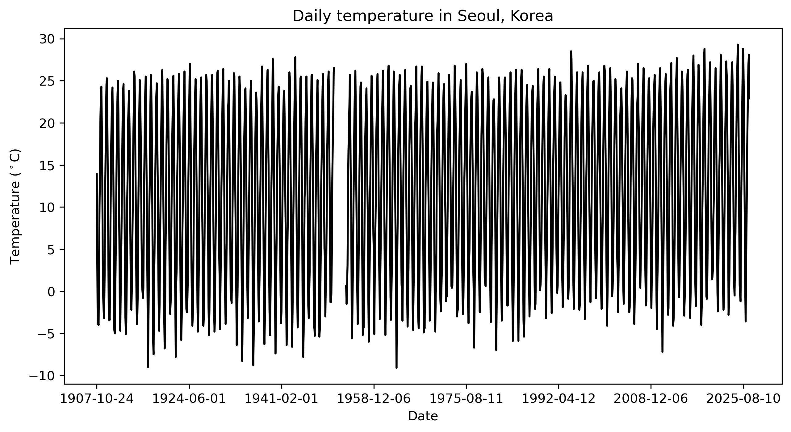
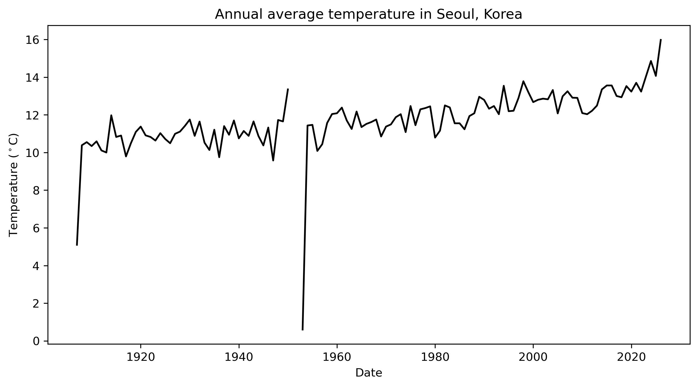
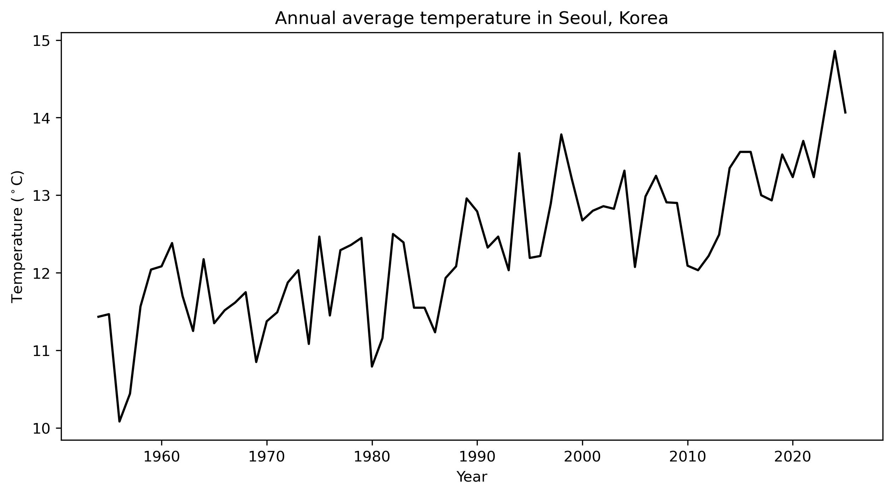
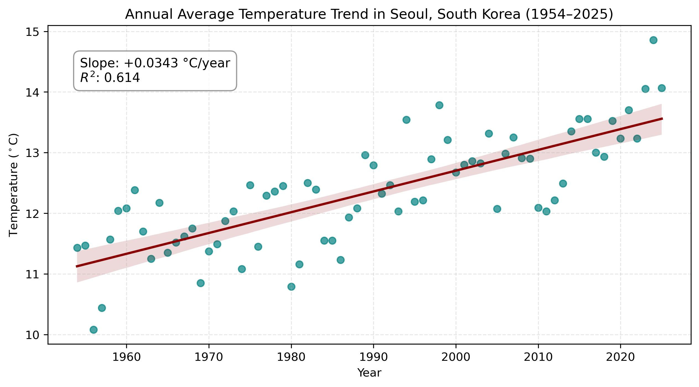
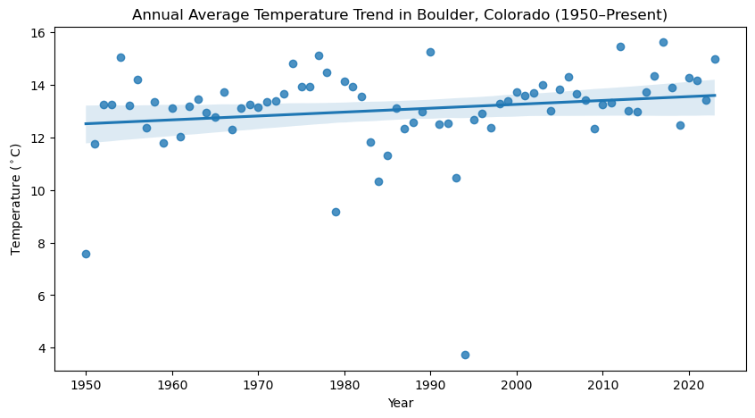

# Long-Term Climate Warming and Urban Heat Island Effect in Seoul, South Korea (1954–2025)
## 1. Study Area and Geographic Context
This analysis examines long-term surface air temperature changes in Seoul, South Korea (Station ID: 108, Songwol-dong station). Located in East Asia, Seoul has undergone rapid industrialization and urban expansion over the past several decades. Investigating Seoul's temperature trajectory allows us to observe both global climate change forcing and the local Urban Heat Island (UHI) effect.

### Data Source and Preprocessing Justification
The dataset was obtained from the Korea Meteorological Administration (KMA) Automated Synoptic Observing System (ASOS). While observations began in late 1907, the historical time series contains critical observational gaps:
- **1907 & 2026:** Incomplete calendar years (1907 records began in October; 2026 is currently ongoing).
- **1950–1953 (Korean War Era):** Severe observational disruption resulted in extensive missing data (e.g., zero valid observations across 1951–1952).

To prevent artificial skewness in annual means, the analytical period was refined to **1954–2025**, providing a completely continuous 72-year record with 100% data completeness.

---

## 2. Plots: Data Cleaning & Trend Analysis

### Initial Exploration and Missing Data Anomalies
As illustrated below, raw aggregation without accounting for missing records during wartime creates extreme artificial troughs in annual temperature computations (notably the 1953 anomaly).

*Figure 1. Daily temperature series for Seoul showing observational disruptions during the early 1950s.*

*Figure 2. Unfiltered annual mean temperature showing extreme distortion caused by missing data during the Korean War.*

---

### Cleaned Annual Series (1954–2025)
Filtering for complete annual cycles yields a robust and continuous representation of interannual temperature variability in post-war Seoul.

*Figure 3. Cleaned annual average temperature series for Seoul (1954–2025).*

---

### Linear Regression Analysis (OLS Trend)
An ordinary least squares (OLS) linear regression was performed to quantify the rate of warming over the 72-year continuous period.

*Figure 4. Linear trend of annual average temperature in Seoul, South Korea (1954–2025), showing a warming rate of +0.0343 °C/year ($R^2 = 0.614$, $p < 0.001$).*

---

## 3. Findings and Interpretation

### Quantitative Evidence
- **Warming Rate (Slope):** $+0.0343 ^\circ\text{C}/\text{year}$ ($+0.343 ^\circ\text{C}/\text{decade}$)
- **Statistical Significance:** $R^2 = 0.614$, $p = 3.94 \times 10^{-16}$ ($p < 0.001$)
- **Total Temperature Rise:** Over the 72-year study period, Seoul's mean annual temperature rose by approximately **$2.47 ^\circ\text{C}$**.

### Discussion: Regional vs. Global Warming Comparison

*Figure 5. Linear trend of annual average temperature in Boulder, Colorado (Baseline).*

Comparing Seoul's warming rate to regional baselines such as Boulder, Colorado (which exhibited an increase of approximately $0.15 ^\circ\text{C}/\text{decade}$ as shown in Figure 5), Seoul has warmed at **more than twice the rate**. 

This accelerated warming is primarily attributed to two primary drivers:
1. **Macro-scale Climate Warming:** Regional warming trends across the Korean Peninsula driven by greenhouse gas forcing.
2. **Intense Urban Heat Island (UHI) Effect:** Post-war reconstruction led to massive high-density concrete infrastructure, reduction of vegetated surfaces, and concentrated anthropogenic heat emissions across the Seoul Metropolitan Area.

This statistical evidence confirms that high-density metropolitan areas experience compounded climate exposure due to local land surface transformations.
